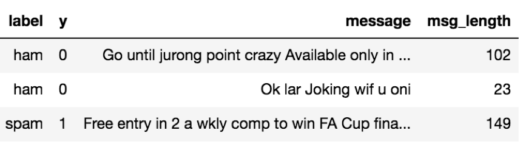
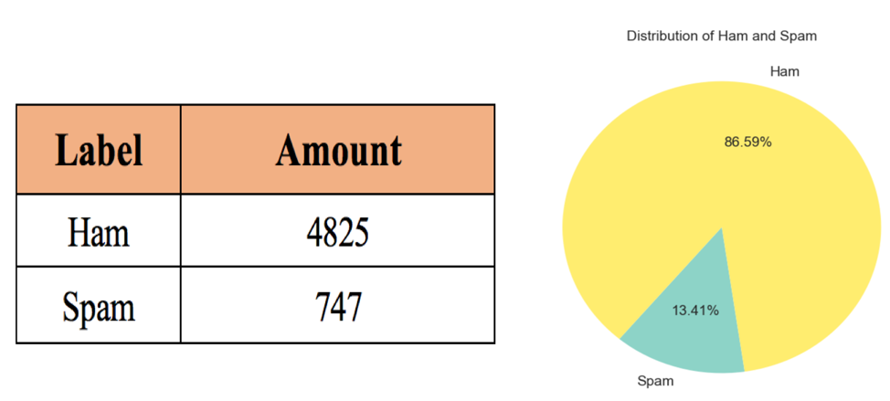
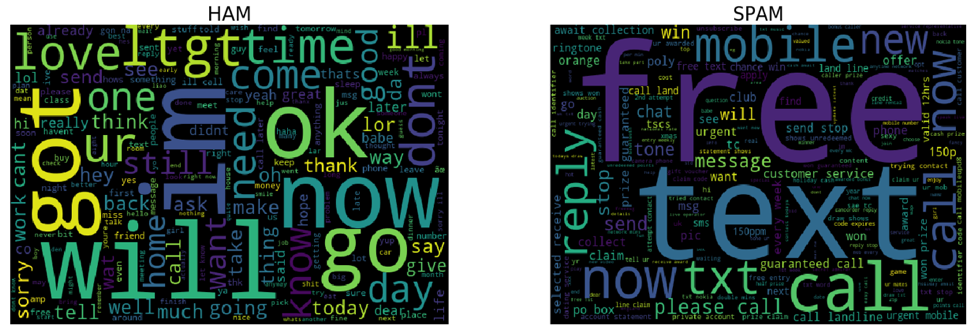
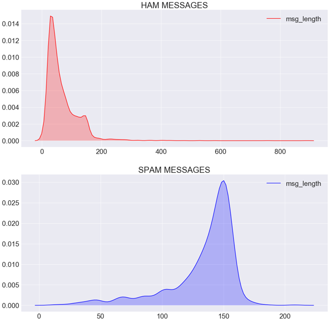
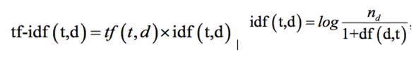
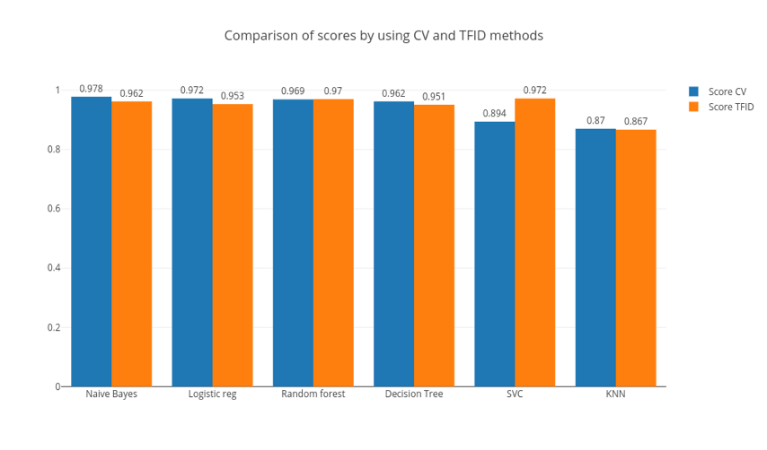
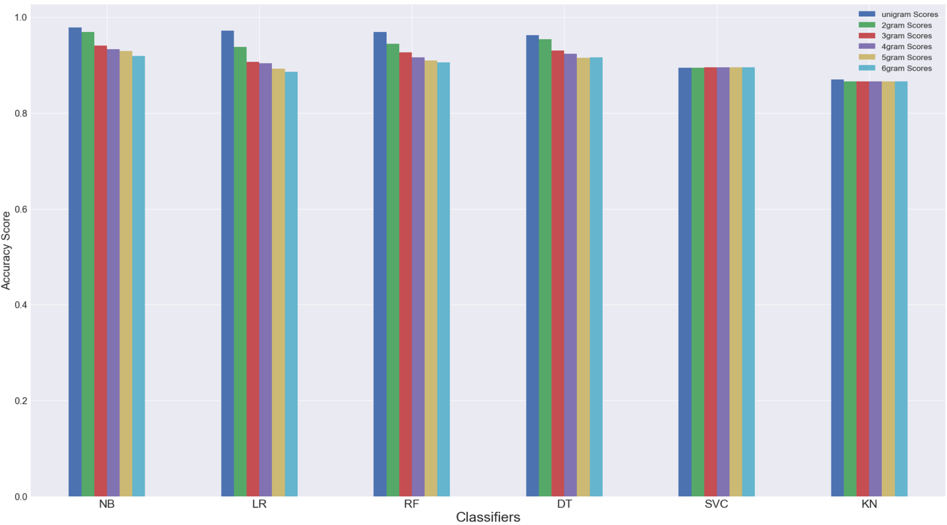

# TEXT-CLASSIFICATION

Introduction:

Spam text messages are becoming more frequent on a daily basis. I wanted to build a model that can predict if a text message is a spam or not with a high accuracy. I used the SMS Spam Collection dataset from the UCI machine learning repository in order to do so. My target labels are Spam or Ham. In our dataset, Ham means that a message is not spam. I used the Naïve Bayes Classifier to produce a high predicting accuracy score. I had to convert the text into a number for our classifiers to work. 

My goals for this project are to:

*	Confirm the Naïve Bayes Classifier is the best for our data by comparing it to 5 other classifiers.
*	Find which method is better to transform our text into usable numerical values:
    * Raw Term Frequency: CountVectorizer
    * TF-IDF: TfidVectorizer.
*	Find out if different n-gram ranges produce better results.

Data Preprocessing:

I needed to clean the data and prepare it to use it for analysis. The first thing I needed to do was to rename the labels of the data to something more meaningful. I renamed the first columns “label” which contains the targets: Spam or Ham. The second column was renamed to “messages” and it contains the text messages. Figure 1 below illustrates the change.

I decided to remove all punctuation marks from the text data. This includes periods, commas, question marks, exclamation marks, etc. This was done by creating a function named "remove_punctuations". I also added two additional columns. The first column was “msg length” which contains the length of the messages per row in my data frame. The second column is a numerical representation of the “label” column, each row contains either a 1 or 0. Ham is 0 and Spam is 1. Figure 2 below demonstrates the final cleaned data frame.

Other data frames were created for quick data analysis. But they are not important, so I omitted them in this report. They can be seen in the Python code.

Exploring the Data:

I will do some data exploration to see if I find any important trends.

Figure 3 above presents the distribution of the labels in my data. 87% of the data is ham. This is a good thing because that means people get more regular text than spam. This is also important to remember later when the data is split for training. 

I wanted to know the most common words present, and to do this I removed the English stop words which are words such as: you, are, this, the, etc. These words have little to no importance in making the classification accurate. After that, I created word clouds.  Figure 4 below illustrates two word-clouds: one for Ham and the other for Spam.

I also explored the length of the messages to see whether the lengths for each label had any significant difference. Figure 5 contains a density graph for each label. You can see that the majority of messages for Ham are between 1 and 180 in length and the majority of messages that are spam range between 110 to 170 in length.

Training the Data
Before I trained the data, I had to split it. I split 70% for training and 30% for testing. Earlier in figure 3, I saw that 13% of the messages were spam. In order to prevent an unbalanced selection of labels during the data split, the stratify attribute of the test split method was used. 

In order to use the text data, I needed to convert it to a numerical value. The two methods available are CountVectorizer and TfidfVectorizer.

CountVectorizer:

The Count Vectorizer takes each word and stores it in a Python dictionary that maps each word to unique integer indices. This produces a sparse matrix. Each index position in the vectors corresponds to the integer value that was stored in countvectorizer dictionary. These values are called raw term frequencies which is the number of times a term occurs in a document (row entry). The stop word attribute was used to remove common English words.

TfidfVectorizer (TF-IDF):

This implantation is the same as CountVectorizer with an additional TF-IDF transformation. This mathematically produces the product of term frequency and Inverse Document Frequency. Equation 1 below is the equation to get the product. It also shows the equation to get idf. 

In simpler words, it weighs down the most frequent words in our data and gives less common words more value to produce better results when it is put through a classifier.

Implementing the TfidVectorizer seems to be more beneficial, but I will test this to confirm.

Classifiers
I believe the Naïve Bayes classifier will be the best to use with my data. To confirm this, I will compare this model to 5 other models: SVC, KNeighbors, Decision Tree, Logistic Regression, and Random Forest.

N-Gram Ranges
I would like to check whether bigger sizes of n-gram ranges increase the accuracy score of the classifiers. I assume that n-grams of size 3 or 4 will have higher accuracy scores than the rest.

Experimental Results and Analysis

Count Vectorizer VS TFIDF Vectorizer Results

After running the classifier, I found that in general, implementing the Count Vectorizer to my classifier produced a higher score with the exception of the SVC Classifier. This is illustrated in Figure 6 below.

Naïve Bayes Classifier of Choice Results.

This assumption is correct. Naïve Bayes did indeed produce the highest prediction accuracy score. This can be seen in the figure above.

N-Gram Assumption Result

After some analysis, i found that higher sizes of n-gram produce lower scores. Figure 7 below illustrates this using a bar plot. You can see that this is true for all the classifiers except for SVC where there is slight increase. 

Conclusion:

1 out of 3 assumptions were correct. The TfidfVectorizer was not the best to use. This could be because it is more effective in a larger data set. The Naïve Bayes classifier was the most accurate. The higher n-gram sizes did not produce better accuracy scores. I learned that to produce the most accurate score, we have to implement the CountVectorizer to the Naïve Bayes classifier using a unigram. 
