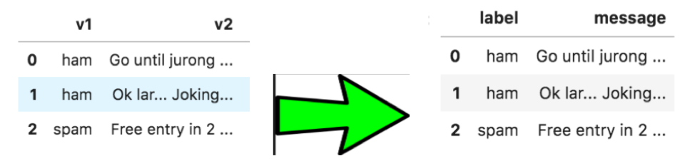

# TEXT-CLASSIFICATION

Introduction:

Spam text messages are becoming more frequent on a daily basis. I wanted to build a model that can predict if a text message is a spam or not with a high accuracy. I used the SMS Spam Collection dataset from the UCI machine learning repository in order to do so. My target labels are Spam or Ham. In our dataset, Ham means that a message is not spam. I used the Naïve Bayes Classifier to produce a high predicting accuracy score. I had to convert the text into a number for our classifiers to work. 

My goals for this project are to:

*	Confirm the Naïve Bayes Classifier is the best for our data by comparing it to 5 other classifiers.
*	Find which method is better to transform our text into usable numerical values:
    * Raw Term Frequency: CountVectorizer
    * TF-IDF: TfidVectorizer.
*	Find out if different n-gram ranges produce better results.

Data Preprocessing:

I needed to clean the data and prepare it to use it for analysis. The first thing I needed to do was to rename the labels of the data to something more meaningful. I renamed the first columns “label” which contains the targets: Spam or Ham. The second column was renamed to “messages” and it contains the text messages. Figure 1 below illustrates the change.

I decided to remove all punctuation marks from the text data. This includes periods, commas, question marks, exclamation marks, etc. This was done by creating a function named "remove_punctuations". I also added two additional columns. The first column was “msg length” which contains the length of the messages per row in my data frame. The second column is a numerical representation of the “label” column, each row contains either a 1 or 0. Ham is 0 and Spam is 1. Figure 2 below demonstrates the final cleaned data frame.

